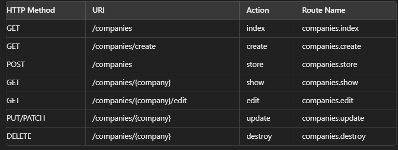
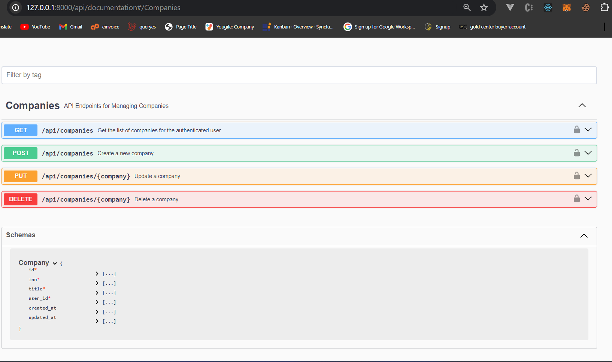

## Instalation

php artisan key:generate
php artisan migrate
composer i
php artisan serve
npm i
npm run dev

## Routes

## Swagged documentation
http://127.0.0.1:8000/api/documentation#/Companies

